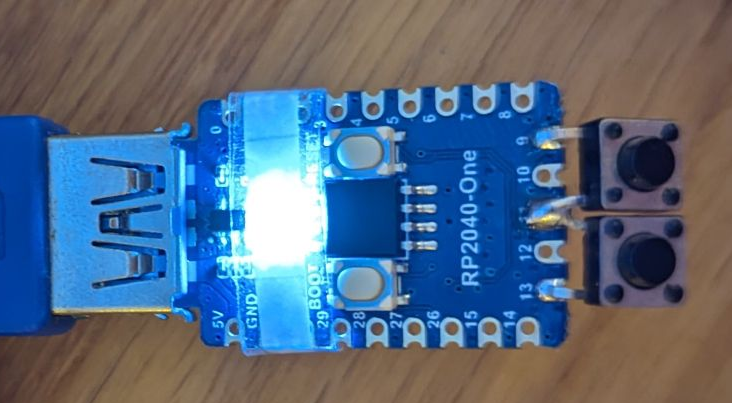

# Mouse Jiggler based on a RP2040-One

A mouse jiggler and keyboard emulator based on a [Waveshare RP2040-One](https://www.waveshare.com/wiki/RP2040-One) with two buttons.

- USB Storage and Serial Console disabled by default
- Hold left button and hit reset button to enable USB Storage and Serial Console
- Left button toggles mouse jiggling
- Right button writes a static string (can be used for master passphrases for example)

## Installation

- Flash [CirquitPython](https://circuitpython.org/board/raspberry_pi_pico/) to your pico
- Copy the files via USB Storage
- Reset

## Pins

- `GPIO13`: Left button
- `GPIO11`: Static high pin for the buttons as input
- `GPIO9`: Right button
- `GPIO16`: Built-in WS2812 RGB LED controller

(See [Waveshare RP2040-One](https://www.waveshare.com/wiki/RP2040-One) for details)

## Files

- `boot.py`: Enables/Disables USB Storage and Serial Console on Pico Boot
- `code.py`: HID Logic
